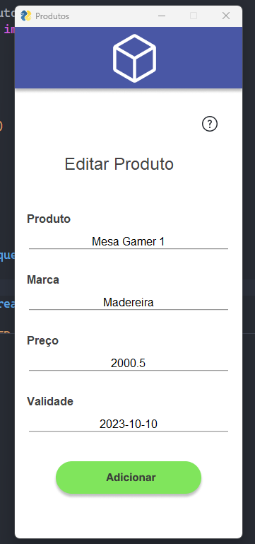

## Desafio de projeto
Para este projeto específico, utilizei .NET7 para criar uma API web que realiza operações CRUD e um endpoint de busca de produtos. No front-end, optei por Python. A integração entre ambos foi bem-sucedida e o resultado pode ser visto no vídeo.

As tecnologias que empreguei neste projeto incluem .NET7, EntityFrameworkCore e SQL Server para o back-end, e Python, PySimpleGUI e PyAutoGUI para o front-end. Estou ansioso para continuar aprimorando minhas habilidades e compartilhando meu conhecimento com a comunidade.

## API DO PROJETO FEITA EM .NET 7 COM Patter Repository & Entity framework core

## INTERFACE DO PROJETO FEITO EM PYTHON

> Tela inicial

> Tela de adicionar

>Tela de editar

>Tela inicial preenchido

## COMO FUNCIONAR O PROJETO

Dentro do projeto contém a API e INTERFACE

